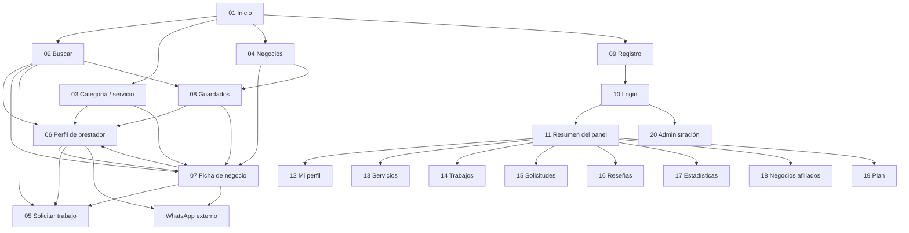

# Rediseño integral de Tequit

Inventario de pantallas, arquitectura de información, guía visual y handoff para Google Stitch y el agente frontend.

## 1. Objetivo del rediseño

Rediseñar Tequit como una experiencia coherente entre sitio público mobile-first, panel de prestadores y consola administrativa, sin alterar inadvertidamente las reglas actuales del producto.

La promesa central es: **“Encuentra quién le sabe.”** La conversión principal es abrir una ficha y contactar por WhatsApp. Las conversiones secundarias son buscar, guardar una opción y enviar una solicitud.

### Verdades actuales que el diseño debe respetar

- El explorador no necesita ni dispone de una cuenta propia.
- Los guardados pertenecen al navegador y dispositivo mediante `localStorage`; no se sincronizan.
- Las solicitudes pueden enviarse sin cuenta.
- No existe checkout, pago, chat interno ni contratación dentro de Tequit.
- WhatsApp es el CTA principal de contacto.
- Las reputaciones de un prestador y un negocio afiliado son independientes.
- Los roles autenticados son prestador, dueño de negocio y administrador.
- El login y varias operaciones del panel siguen siendo una demo; el diseño debe contemplar estados reales sin prometer funciones aún inexistentes.

### Decisiones que deben permanecer visibles como pendientes

1. Si en el futuro habrá cuentas de explorador y sincronización de guardados.
2. Si el dueño de negocio tendrá un panel distinto al de prestador.
3. Si “Solicitar Pro” será lista de espera, contacto comercial o pago.
4. Cómo se crearán y administrarán negocios completos desde el panel.
5. Si filtros de zona/categoría serán funcionales y si habrá cercanía o mapa.

Stitch puede representar estas ideas como futuras, pero el agente frontend no debe implementarlas como funcionalidad existente.

## 2. Arquitectura general

Tequit necesita tres shells visuales claramente diferenciados:

| Shell | Audiencia | Navegación | Rutas |
| --- | --- | --- | --- |
| Público | Explorador, visitante, prestador potencial | Header desktop, barra inferior móvil y footer | `/`, búsqueda, fichas, guardados, solicitud, login y registro |
| Panel | Prestador y, de forma parcial, dueño de negocio | Sidebar desktop y navegación horizontal/menú móvil | `/dashboard/**` |
| Administración | Equipo Tequit | Navegación administrativa propia y salida segura al sitio | `/admin` |

Recomendación de rediseño: no mostrar simultáneamente header/footer público y navegación del panel o administración. El layout actual los hereda globalmente, pero el nuevo sistema debe tratar cada shell como un contexto de trabajo distinto.

## 3. Mapa de navegación y relaciones

### Journeys prioritarios

#### Explorador: descubrir → evaluar → conectar → guardar

1. Entra a Inicio, una categoría o una búsqueda compartida.
2. Busca con lenguaje natural y filtra entre personas y negocios.
3. Abre una ficha y evalúa servicios, trabajos, reputación y verificaciones.
4. Contacta por WhatsApp o envía una solicitud.
5. Puede guardar antes o después de evaluar y volver desde Guardados.

KPI: búsqueda → ficha; ficha → WhatsApp; retorno a guardados.

#### Visitante: resolver rápido

1. Entra desde móvil.
2. Identifica Tepic/zona, reputación y tipo de oferta sin aprender categorías internas.
3. Contacta en máximo dos interacciones desde un resultado relevante.

KPI: tiempo a primera ficha y tap a WhatsApp.

#### Prestador: publicar → recibir → responder → mejorar

1. Se registra o inicia sesión.
2. Completa perfil, servicios y trabajos.
3. Recibe solicitudes y cambia su estado.
4. Contacta al cliente y revisa reputación/estadísticas.
5. Gestiona afiliación a negocio y conoce límites del plan.

KPI: perfil publicado; solicitud atendida; contacto; completitud del perfil.

#### Administrador: supervisar → moderar → habilitar

1. Inicia sesión con rol administrativo.
2. Revisa salud general, prestadores y planes.
3. Modera reseñas y consulta taxonomía.

KPI: tiempo de moderación y perfiles activos/verificados.

## 4. Inventario completo de pantallas

Hay **20 rutas de interfaz**. Los endpoints `/api/**`, `robots.ts` y `sitemap.ts` no son pantallas y no deben generarse en Stitch.

### A. Sitio público — descubrimiento y conversión

| ID | Ruta | Pantalla y objetivo | Entradas | Salidas/relaciones | Brief específico para Stitch |
| --- | --- | --- | --- | --- | --- |
| 01 | `/` | **Inicio.** Presentar la promesa, búsqueda, categorías, servicios populares, prestadores verificados, negocios y CTA para publicar perfil. | Acceso directo, logo, navegación | Buscar, servicio, perfil, negocio, registro | Hero editorial con oficio real de Tepic; buscador dominante; prueba de confianza; secciones escaneables sin saturación de tarjetas. Mobile: valor y buscador visibles antes del primer scroll. |
| 02 | `/buscar?q=&type=&verified=` | **Resultados de búsqueda.** Comparar personas y negocios por relevancia, reputación, verificaciones y zona. | Inicio, categoría, header, búsqueda interna | Perfil, negocio, guardados, solicitud personalizada | Encabezado con consulta editable; chips Todos/Personas/Negocios/Verificados; filtros desktop laterales y mobile en bottom sheet; lista con jerarquía clara y CTA secundario “Ver perfil/negocio”. |
| 03 | `/servicios/[slug]` | **Landing de categoría/servicio.** Resolver búsquedas SEO como “Plomería en Tepic”. | Categorías de Inicio, enlaces externos | Perfil, negocio, nueva búsqueda | Encabezado SEO local, resumen de opciones, mismo lenguaje de resultados. Debe sentirse parte del buscador, no micrositio separado. |
| 04 | `/negocios` | **Directorio de negocios.** Explorar comercios con productos, servicios o ambos. | Inicio, header, barra inferior | Ficha de negocio, guardar, buscar | Portada compacta, búsqueda y grid/lista de negocios; diferenciarlos visualmente de personas sin romper el sistema. |
| 05 | `/solicitar?provider=&business=&service=` | **Solicitud general o dirigida.** Capturar necesidad y datos de contacto sin cuenta. | Sin resultados, perfil, negocio, header | Éxito con folio; regreso al origen | Formulario por bloques: necesidad, ubicación/tiempo, fotos, contacto y privacidad. En móvil usar una sola columna y CTA persistente sólo si no tapa contenido. |
| 06 | `/p/[providerSlug]` | **Perfil público de prestador.** Construir confianza y provocar contacto. | Resultados, categoría, guardados, negocio afiliado | WhatsApp, solicitud dirigida, negocio afiliado, guardar | Hero con identidad/profesión/zona/rating; CTA WhatsApp dominante; servicios, trabajos, bio, zonas, reseñas y verificaciones. Mobile: resumen de confianza y CTA antes de galería extensa. |
| 07 | `/n/[businessSlug]` | **Ficha pública de negocio.** Mostrar oferta, productos, equipo y contacto. | Directorio, resultados, guardados, perfil afiliado | WhatsApp, solicitud dirigida, perfil del equipo, guardar | Hero de negocio con categoría, dirección y reputación; servicios y productos diferenciados; equipo afiliado; CTA por producto sin simular carrito. |
| 08 | `/guardados` | **Guardados del dispositivo.** Retomar opciones comparables. | Barra inferior, footer, corazones en cards | Perfil, negocio, buscar | Explicar discretamente “En este dispositivo”; agrupar o distinguir Personas/Negocios; permitir quitar guardado; estado vacío accionable. No mostrar login como requisito. |

### B. Acceso y onboarding de oferta

| ID | Ruta | Pantalla y objetivo | Entradas | Salidas/relaciones | Brief específico para Stitch |
| --- | --- | --- | --- | --- | --- |
| 09 | `/registro` | **Crear perfil de prestador o negocio.** Dar de alta oferta Free. | Inicio, footer, login | Éxito de registro, login | Selector de tipo de cuenta al inicio; formulario progresivo o secciones claras; explicar límite de 5 servicios sin convertir el plan en distracción. Diseñar variantes prestador y negocio aunque hoy compartan campos. |
| 10 | `/login?next=` | **Iniciar sesión.** Acceso de prestador, negocio o admin. | Header/barra inferior, registro, rutas protegidas | Dashboard, admin o destino original | Pantalla compacta y confiable; correo/contraseña, error inline, recuperación futura marcada como no implementada. Las credenciales demo sólo deben mostrarse en entorno demo. Dejar claro que no es una cuenta de explorador. |

### C. Panel de prestador

| ID | Ruta | Pantalla y objetivo | Entradas | Salidas/relaciones | Brief específico para Stitch |
| --- | --- | --- | --- | --- | --- |
| 11 | `/dashboard` | **Resumen.** Mostrar movimiento reciente y trabajo pendiente. | Login, navegación del panel | Solicitudes y ocho módulos | Dashboard orientado a acciones: métricas compactas, solicitudes por atender y alertas de completitud. Evitar gráficas decorativas. |
| 12 | `/dashboard/perfil` | **Mi perfil.** Editar información pública. | Navegación del panel | Guardar, vista previa pública | Formulario editable con previsualización o enlace “Ver perfil público”; estados guardando/guardado/error; agrupar identidad, descripción, zona y contacto. |
| 13 | `/dashboard/servicios` | **Servicios.** Activar, desactivar y agregar oferta. | Navegación, resumen | Plan al llegar al límite | Mostrar contador `n de 5`, estado de cada servicio, alta rápida y límite Free. Diseñar lista, vacío, error y límite alcanzado. |
| 14 | `/dashboard/trabajos` | **Portafolio.** Administrar evidencia visual. | Navegación, resumen/completitud | Cargar/editar trabajo, perfil público | Galería gestionable y formulario de carga con preview, progreso, validación de formato/peso y confirmación. Priorizar calidad de imágenes y orden. |
| 15 | `/dashboard/solicitudes` | **Solicitudes.** Revisar lead y avanzar estado. | Resumen, navegación | WhatsApp al cliente, cambio de estado | Inbox/lista + detalle en desktop y pantallas apiladas en móvil; datos privados claramente señalados; estados nueva, vista, interesado, no me interesa, contactado y cerrada. |
| 16 | `/dashboard/resenas` | **Reseñas.** Entender reputación y solicitar reseña anterior. | Navegación | Generar enlace de invitación | Resumen de rating, lista cronológica, fuente/estado y CTA para generar enlace. Diseñar vacío sin reputación y enlace pendiente/creado. |
| 17 | `/dashboard/estadisticas` | **Estadísticas.** Entender visibilidad y conversión. | Navegación | Perfil/servicios como acciones de mejora | Selector 7/30 días; vistas, WhatsApp, solicitudes y conversión; términos de búsqueda. Usar gráfica sólo si aporta tendencia real; incluir cero datos. |
| 18 | `/dashboard/negocios` | **Negocios y afiliaciones.** Ver relación actual o iniciar negocio. | Navegación, perfil | Negocio público, futura alta de negocio | Separar “Afiliaciones” de “Mis negocios”; explicar que ratings no se transfieren. Diseñar estados sin afiliación, pendiente, activa y rechazada. |
| 19 | `/dashboard/plan` | **Plan.** Explicar Free y futuro Pro. | Navegación, límite de servicios | Solicitar Pro | Comparación honesta, plan actual visible, beneficios verificables y CTA no transaccional mientras no haya pagos. Evitar patrones de presión. |

### D. Operación interna

| ID | Ruta | Pantalla y objetivo | Entradas | Salidas/relaciones | Brief específico para Stitch |
| --- | --- | --- | --- | --- | --- |
| 20 | `/admin` | **Panel administrativo.** Supervisar métricas, planes, moderación y taxonomía. | Login admin | Perfil público, acciones de plan/moderación | Shell administrativo denso pero legible; métricas, tabla de prestadores, cola de moderación y taxonomía como módulos distinguibles. En producción conviene dividirlo después en subrutas. |

## 5. Variantes y estados obligatorios

Estas variantes no tienen URL propia, pero deben producirse en Stitch y conservarse en el handoff.

| Familia | Estados mínimos |
| --- | --- |
| Búsqueda | Inicial sin consulta, con resultados mixtos, sólo personas, sólo negocios, filtros activos, cero resultados, error y carga/skeleton |
| Cards | Prestador normal/verificado/guardado; negocio normal/guardado; contenido largo; sin imagen; rating nuevo/sin reseñas |
| Guardados | Vacío, con resultados mixtos, después de quitar el último elemento y almacenamiento no disponible |
| Perfil público | Completo, sin trabajos, sin reseñas, sin afiliación, contenido no encontrado/404 |
| Ficha de negocio | Con servicios y productos, sólo productos, sin equipo, sin reseñas, no encontrada/404 |
| Solicitud | Inicial, validación inline, carga, error de red/servidor y éxito con folio |
| Login | Inicial, credenciales incorrectas, carga, sesión expirada y redirección por ruta protegida |
| Registro | Prestador, negocio, validación, envío, error y éxito |
| Perfil editable | Sin cambios, cambios sin guardar, guardando, guardado y error |
| Servicios | Lista, vacío, alta, límite Free, desactivado y error |
| Trabajos | Galería, vacío, archivo seleccionado/preview, carga, formato/peso inválido y éxito |
| Solicitudes | Vacío, nueva, vista, interesado, no me interesa, contactado, cerrada y error al cambiar estado |
| Reseñas | Con reseñas, sin reseñas, enlace pendiente, enlace generado y error |
| Estadísticas | Datos normales, cero datos, carga y error |
| Afiliaciones | Ninguna, pendiente, activa, rechazada y creación de negocio aún no disponible |
| Plan | Free normal, límite alcanzado, solicitud Pro enviada y Pro activo futuro |
| Administración | Datos normales, tabla vacía, moderación pendiente/aprobada/rechazada y error de acción |

Todos los estados vacíos deben terminar en una acción concreta. Todos los errores deben explicar qué pasó en lenguaje sencillo y permitir reintentar cuando corresponda.

## 6. Guía de diseño para sitio y app web

### 6.1 Dirección creativa

**Concepto:** oficio humano + confianza local + claridad de marketplace.

La interfaz debe sentirse propia de Tepic sin recurrir a folclor decorativo. Debe mostrar manos, materiales, espacios reales, personas trabajando y negocios locales. La calidez vive en fotografía, textura y color; la estructura debe permanecer precisa y fácil de escanear.

Evitar:

- Estética genérica de SaaS con muchas tarjetas flotantes.
- Gradientes tecnológicos, glassmorphism excesivo o neón.
- Fotos corporativas posadas o renders artificiales de oficios.
- Insignias que sugieran garantía cuando sólo hay una verificación puntual.
- Mezclar personas y negocios sin señales visuales claras.
- Simular disponibilidad inmediata, precio cerrado o contratación interna.

### 6.2 Principios de experiencia

1. **Valor en dos toques:** desde Inicio se debe llegar a opciones relevantes con una búsqueda o categoría y abrir una ficha con el siguiente toque.
2. **Confianza antes que promoción:** rating, número de reseñas, verificaciones, trabajos y zona deben leerse antes de slogans.
3. **WhatsApp sin ambigüedad:** es el CTA primario en fichas; “Solicitar trabajo” es secundario.
4. **Progresión, no saturación:** revelar detalles extensos conforme el usuario evalúa.
5. **Móvil como escenario principal:** targets grandes, navegación al alcance del pulgar y formularios de una columna.
6. **Honestidad operacional:** distinguir claramente acciones reales, demo y próximas funciones.

### 6.3 Paleta propuesta

Mantiene la identidad existente, refinada para contraste y consistencia.

| Token | Valor | Uso |
| --- | --- | --- |
| `ink-900` | `#17231D` | Texto principal |
| `forest-900` | `#254432` | Verde oficial del logo, marca y navegación |
| `forest-700` | `#35634A` | Hover y elementos secundarios |
| `leaf-600` | `#2D7456` | Señales positivas y verificaciones |
| `clay-700` | `#C75B3A` | Barro oficial del logo; acento, no texto normal pequeño |
| `clay-100` | `#F7DDD2` | Estado guardado y acentos suaves |
| `cream-100` | `#F7F1E7` | Fondos cálidos y agrupación |
| `paper` | `#FFF9F0` | Marfil oficial del logo y fondo principal |
| `white` | `#FFFFFF` | Cards y campos |
| `muted-700` | `#5D6A64` | Texto secundario |
| `line-300` | `#DCE4DE` | Bordes y divisores |
| `success-700` | `#186A3B` | Confirmaciones |
| `warning-700` | `#8A5B00` | Advertencias y estados pendientes |
| `error-700` | `#A33A2B` | Errores |
| `focus` | `#E3A600` | Anillo de foco visible |
| `whatsapp` | `#08783E` | CTA WhatsApp con texto blanco |

No depender sólo del color para estados: acompañar con icono y texto.

### 6.4 Tipografía

- **Display:** Fraunces, pesos 600–700. Usar en titulares y cifras con personalidad, no en controles ni tablas.
- **UI y lectura:** Manrope, pesos 400–750. Usar en cuerpo, botones, campos, navegación y datos.
- Base móvil: 16 px; cuerpo 16–18 px con interlineado 1.5–1.65.
- Escala sugerida: 12, 14, 16, 18, 22, 28, 36, 48, 64 px.
- Evitar texto menor a 12 px y mayúsculas largas. Eyebrows sólo para contexto breve.

Si se evita cargar fuentes externas, definir fallbacks equivalentes y comprobar que el layout no cambie de forma crítica.

### 6.5 Espaciado, forma y elevación

- Unidad base: 4 px; escala principal 4, 8, 12, 16, 24, 32, 48, 64, 96.
- Contenedor desktop: máximo 1200 px; gutters 24–32 px.
- Mobile: gutter de 16 px; en pantallas muy estrechas nunca menos de 12 px.
- Radios: 10 px controles, 16 px cards compactas, 24 px superficies editoriales, píldora sólo para chips/estado.
- Bordes suaves de 1 px. Usar sombra únicamente para elevación interactiva o elementos sticky.
- No meter cada bloque dentro de una card; usar espacio, tipografía y divisores para jerarquía.

### 6.6 Layout responsive

| Rango | Comportamiento |
| --- | --- |
| `< 640 px` | Una columna, barra inferior pública, formularios apilados, CTA de ficha accesible, filtros en sheet |
| `640–899 px` | Una o dos columnas según contenido; navegación compacta; panel con tabs desplazables o drawer |
| `900–1199 px` | Grid de dos columnas; filtros laterales; sidebar del panel |
| `≥ 1200 px` | Contenedor de 1200 px; grids de tres columnas cuando las cards mantengan lectura cómoda |

Diseñar primero en **390 × 844** y después en **1440 × 1024**. Validar también 320 px de ancho y zoom de navegador al 200%.

### 6.7 Navegación

#### Shell público

- Desktop: marca, Buscar, Negocios, Publicar necesidad, Soy prestador y ubicación.
- Mobile: Inicio, Buscar, Negocios, Guardados y Cuenta.
- Mostrar estado activo y respetar safe areas.
- “Cuenta” lleva al login de oferta; el copy contextual debe aclararlo para no sugerir una cuenta de explorador.

#### Panel

- Desktop: sidebar persistente con Resumen, Mi perfil, Servicios, Trabajos, Solicitudes, Reseñas, Estadísticas, Negocios y Plan.
- Mobile: header del panel + drawer o tabs agrupados; no una fila horizontal de nueve enlaces.
- Incluir “Ver perfil público” y “Salir” como acciones contextuales.

#### Administración

- Shell propio con identidad “Administración Tequit”, navegación interna escalable y enlace de regreso al sitio.

### 6.8 Componentes canónicos

Stitch debe producir variantes coherentes de estos componentes antes de generar todas las pantallas:

1. Header público, bottom navigation, footer, sidebar/drawer de panel y shell admin.
2. Buscador principal, buscador compacto, chips y filtro mobile/desktop.
3. Card de prestador y card de negocio; no deben ser la misma card con una etiqueta distinta.
4. Rating, contador de reseñas, verificación explicada, zona, estado y plan badge.
5. Botones Primary, WhatsApp, Secondary, Ghost, Destructive y estados loading/disabled.
6. Corazón guardado/no guardado con snackbar y `aria-label` dinámico.
7. Campos de texto, textarea, select, radio cards, carga de archivos y errores inline.
8. Galería/portafolio, reseña, servicio, producto, afiliación y solicitud.
9. Empty state, skeleton, banner de error, éxito con folio y confirmación no destructiva.
10. Métrica, tabla responsive, timeline/selector de estado y comparación de plan.

### 6.9 Fotografía e ilustración

- Fotografías documentales, luz natural y contexto local; mostrar el trabajo, no sólo retratos.
- Diversidad real de oficios, edades y géneros, sin estereotipos.
- Mantener espacio negativo suficiente para texto en hero.
- Aspect ratios recomendados: hero 16:9/4:5 adaptable; trabajos 4:3; negocio 16:10; avatar 1:1.
- Definir fallback con iniciales o superficie de marca cuando falte imagen.
- No incrustar texto dentro de fotografías generadas.

### 6.10 Iconografía y movimiento

- Usar Lucide de manera consistente, trazo aproximado de 1.75–2 px.
- Iconos de 20–24 px en navegación/acciones; 16–18 px junto a texto.
- Transiciones de 120–220 ms; elevación breve en hover y feedback inmediato al guardar.
- Respetar `prefers-reduced-motion`; ninguna información puede depender de animación.
- Evitar rebotes llamativos en acciones frecuentes.

### 6.11 Accesibilidad

- WCAG 2.2 AA: contraste 4.5:1 para texto normal y 3:1 para texto grande/componentes.
- Target mínimo de 44 × 44 px.
- Foco visible y orden lógico de teclado.
- Un `h1` por pantalla y jerarquía de headings sin saltos arbitrarios.
- Labels persistentes; placeholder nunca sustituye al label.
- Errores asociados a sus campos y resumen de errores en formularios largos.
- `aria-label` de WhatsApp debe incluir el nombre del prestador/negocio.
- Tablas administrativas deben conservar encabezados y tener alternativa apilada en móvil.
- Mensajes de carga, éxito y error deben anunciarse a tecnologías de asistencia.

### 6.12 Voz y copy

- Español de México, cercano, directo y respetuoso.
- Frases cortas y concretas: “Busca”, “Compara”, “Guarda”, “Escribe”.
- CTA principal: **“Contactar por WhatsApp”**.
- CTA secundario: **“Solicitar trabajo”**.
- Guardar: **“Guardar” / “Quitar de guardados”**.
- No resultados: **“No encontramos una coincidencia exacta. Cuéntanos qué necesitas y te ayudamos a encontrar opciones.”**
- Error genérico: **“No pudimos completar la acción. Revisa tu conexión e inténtalo de nuevo.”**
- Nunca usar “garantizado”, “el mejor”, “disponible ahora” ni urgencia artificial.

## 7. Prompt maestro para Google Stitch

Usar este bloque al iniciar el proyecto y conservarlo en cada iteración:

> Diseña Tequit, un marketplace local mobile-first para encontrar prestadores y negocios en Tepic, Nayarit. La promesa es “Encuentra quién le sabe”. El producto ayuda a buscar, evaluar señales de confianza y contactar directamente por WhatsApp; no incluye checkout, pagos, chat interno ni cuenta de explorador. La dirección visual combina oficio humano, calidez local y precisión editorial: fondos papel y crema, verde bosque profundo, acento barro, fotografía documental de trabajo real, tipografía Fraunces para títulos y Manrope para interfaz. Evita estética SaaS genérica, exceso de cards, glassmorphism y fotografías corporativas. Prioriza jerarquía, espacio, contraste WCAG AA y targets de 44 px. En móvil usa 390 × 844; en desktop 1440 × 1024 con contenedor máximo de 1200 px. Usa componentes consistentes, estados de carga/vacío/error/éxito y `prefers-reduced-motion`. WhatsApp es el CTA primario en fichas y “Solicitar trabajo” es secundario. No inventes precios, disponibilidad, garantías, mapas ni funciones futuras.

Después del bloque maestro, anexar el brief específico de la tabla de la sección 4 y pedir explícitamente las variantes de la sección 5 correspondientes.

### Ejemplo de prompt por pantalla

> Genera la pantalla 06, Perfil público de prestador, en mobile 390 × 844 y desktop 1440 × 1024. Conserva el sistema visual maestro. Incluye nombre, profesión, zona, rating con número de reseñas, verificaciones explicables, servicios, galería de trabajos, bio, zonas de servicio, reseñas, afiliación opcional y formulario de solicitud. “Contactar por WhatsApp” debe dominar y “Solicitar trabajo” ser secundario. En móvil, coloca resumen de confianza y CTA antes de la galería. Genera también variantes sin trabajos, sin reseñas y sin afiliación. No agregues precio cerrado, agenda, chat ni garantía.

## 8. Orden recomendado para generar en Stitch

No conviene generar 20 pantallas aisladas. Trabajar por sistema y validar cada lote:

1. **Fundación:** tokens, tipografía, botones, campos, chips, cards y tres shells.
2. **Flujo explorador:** 01 Inicio, 02 Buscar, 06 Perfil, 05 Solicitar, 08 Guardados.
3. **Negocios y SEO:** 04 Negocios, 07 Ficha de negocio, 03 Servicio.
4. **Acceso:** 09 Registro y 10 Login.
5. **Panel núcleo:** 11 Resumen, 12 Perfil, 13 Servicios, 14 Trabajos, 15 Solicitudes.
6. **Panel secundario:** 16 Reseñas, 17 Estadísticas, 18 Negocios y 19 Plan.
7. **Operación:** 20 Administración.
8. **Estados:** vacíos, carga, errores, éxitos, límites, 404 y contenido extremo.

Al terminar cada lote, revisar consistencia de navegación, tokens y componentes antes de generar el siguiente.

## 9. Paquete de handoff para el agente frontend

El handoff de Stitch debe incluir:

- Export o enlace de cada pantalla mobile y desktop con el ID de este documento.
- Variantes/estados asociados y nombre exacto, por ejemplo `02-search-empty-mobile`.
- Tokens de color, tipo, spacing, radios, sombras y breakpoints; no valores ad hoc por pantalla.
- Inventario de componentes con variantes y comportamiento responsive.
- Assets originales separados de los screenshots; licencias y fuente documentadas.
- Anotaciones de interacción: destino de cada CTA, hover, focus, loading, error y éxito.
- Copy final en texto editable.
- Decisiones pendientes marcadas como `FUTURE`, no mezcladas con MVP.

### Reglas de implementación

1. Mantener las rutas y query params de la sección 4 salvo decisión explícita de producto.
2. Preservar la semántica de servidor/cliente de Next.js y leer la guía local de Next antes de editar código.
3. Separar layouts público, panel y administración.
4. Construir componentes canónicos; no copiar markup distinto para cada pantalla.
5. Mantener el guardado local actual hasta que exista una decisión de cuentas de explorador.
6. No romper eventos `profile_view`, `business_view`, `whatsapp_click`, `request_created` y `service_view`.
7. Conservar validaciones de formularios, privacidad de fotos/leads y autorización por rol.
8. Implementar primero mobile, luego desktop, y verificar 320 px, 390 px, 768 px, 1024 px y 1440 px.
9. Verificar teclado, foco, lectores, contraste, reduced motion y contenido largo.
10. No considerar terminada una pantalla sólo por igualar un screenshot: debe cubrir todos sus estados.

### Criterios de aceptación globales

- Dado un explorador en Inicio, cuando busca o toca una categoría, entonces llega a opciones relevantes en una interacción.
- Dado un resultado, cuando abre una ficha, entonces entiende tipo de entidad, zona, reputación y verificaciones antes de contactar.
- Dado un perfil o negocio, cuando activa WhatsApp, entonces el CTA es inequívoco, accesible y registra el evento antes de abrir la app externa.
- Dado un formulario inválido, cuando intenta enviarlo, entonces conserva sus datos y muestra errores comprensibles.
- Dado un fallo de red, cuando una operación falla, entonces informa el error y ofrece reintento sin perder el trabajo del usuario.
- Dado un estado vacío, cuando no hay contenido, entonces explica la situación y ofrece una acción concreta.
- Dado un usuario con movimiento reducido, cuando navega, entonces no recibe animaciones no esenciales.
- Dado cualquier viewport soportado, cuando navega por teclado o con zoom al 200%, entonces el contenido y acciones siguen disponibles sin solaparse.

## 10. Matriz de trazabilidad

| KPI/objetivo | Pantallas principales | Componentes/eventos |
| --- | --- | --- |
| Búsqueda → ficha | 01, 02, 03, 04, 08 | Buscador, filtros, cards, `profile_view`, `business_view`, `service_view` |
| Ficha → WhatsApp | 06, 07 | CTA WhatsApp, prueba de confianza, `whatsapp_click` |
| Solicitud enviada | 05, 06, 07 | Formulario, error, éxito con folio, `request_created` |
| Retorno a guardados | 02, 04, 06, 07, 08 | Corazón, snackbar, lista local |
| Perfil publicado/completo | 09, 11–14 | Registro, perfil, servicios, portafolio |
| Solicitud atendida | 11, 15 | Lista/detalle, estados, WhatsApp al cliente |
| Reputación | 06, 07, 16, 20 | Rating, reseña, invitación, moderación |
| Operación y monetización piloto | 13, 17, 19, 20 | Límites, métricas, plan y acciones admin |

## 11. Riesgos del rediseño

- **Confusión de cuenta:** la barra móvil dice “Cuenta”, pero no hay cuenta de explorador. Resolver con copy y contexto, no inventando autenticación.
- **Shells mezclados:** el layout global actual envuelve panel y admin con navegación pública. El nuevo diseño necesita layouts separados.
- **Registro inconsistente:** seleccionar “Negocio” conserva campos pensados para prestador. Diseñar variantes y decidir backend antes de implementar el flujo de negocio.
- **Filtros aparentes:** zona y categoría se muestran, pero hoy no alteran resultados. No elevarlos visualmente como controles completos sin implementación.
- **Persistencia percibida:** explicar “En este dispositivo” para que un guardado local no se interprete como sincronizado.
- **Promesas de Pro:** no diseñar checkout ni beneficios activos no respaldados.
- **Contenido demo:** diseñar para nombres, descripciones e imágenes reales, incluyendo contenido largo y datos faltantes.

## 12. Fuente de este inventario

Este documento se derivó de las rutas y componentes existentes en `app/`, `components/`, el modelo de datos, la navegación y las reglas actuales del producto. No se encontró un directorio `stitch_reference/` en el repositorio; por ello la dirección visual propuesta parte de la identidad actual de Tequit y no de assets externos de Stitch.
